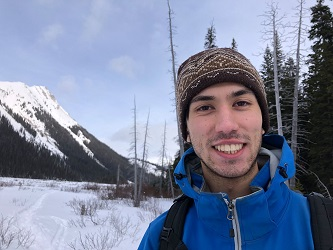

# ✨ My GitHub profile ✨
[LinkedIn](https://www.linkedin.com/in/logan-perry-din/)

[Portfolio site](https://logan-pd.github.io/)

## I ...
study Computer Science, Networks, and Philosophy at the University of Calgary.

also Ski, Bike, and Canoe every where in Western Canada.

### heres some pictures of me in the mountains

